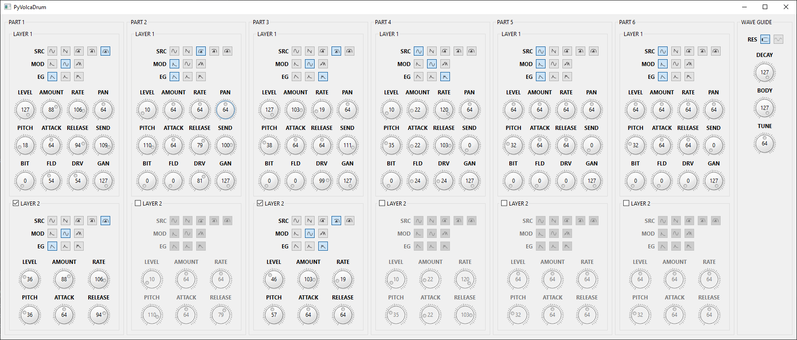

# Introduction

This is a simple GUI application which allows co fully configure KORG volca drum sound generator from PC.
All values are sent from PC to volca drum via MIDI port.

# Prerequisites

In order ro run this application the following are items required:
- KORG volca drum device itself.
- MIDI port to connect volca drum device to.
- Python, at least Python 3.6 is required.
- The following Python packages need to be installed: `PySide6`, `jsonschema`, `mido`, `python-rtmidi`.

# Notes

- This application designed for "split channels" configuration (factory default).
  If volca drum is configured to "single channel" mode this application will not work.
- This application stores its state in a configuration file:
  - When the application is closed, it stores values for all controls to a simple configuration file.
  - The configuration file is named `config.json` and it is placed side-by-side with the `main.py` file.
  - When the application is started, it loads all previously stored values from the configuration file (if exists).
